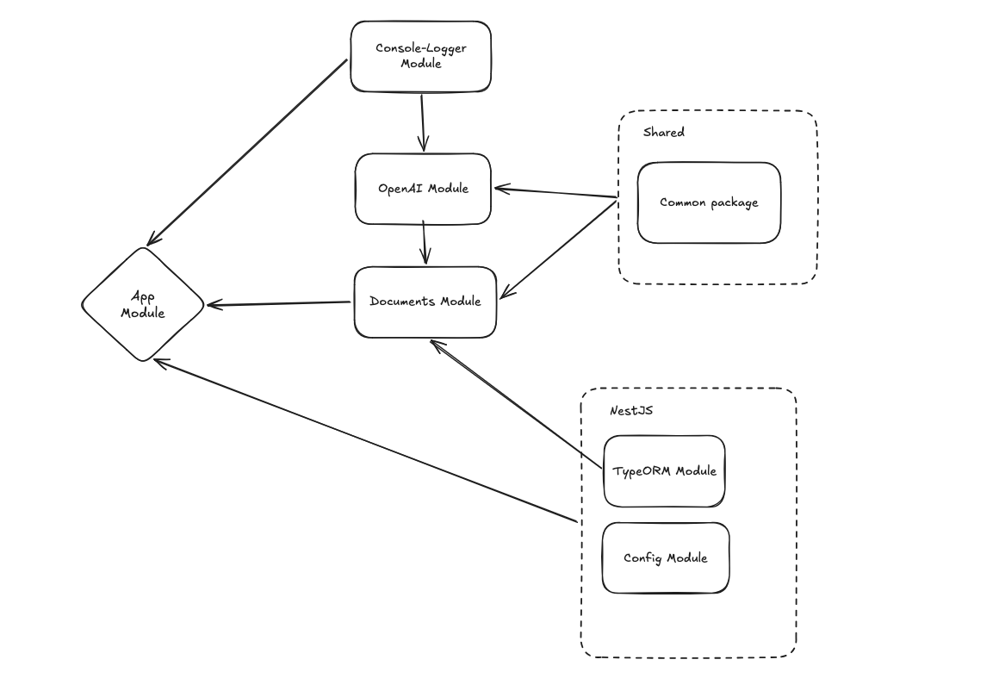

# File meta data parser

> Thoughts and notes about the decisions made, tradeoffs, and future plans can be found in [thoughts-and-notes.md](readme/thoughts-and-notes.md)

## Project structure


[Excalidraw link](https://excalidraw.com/#json=jV3kgAwSY17iwIMILDH-d,-kDURXd4XBzEYKQO8TUuXA)

### Note

Please, check the **Project structure** suggestions section out in the [Thoughts and notes](readme/thoughts-and-notes.md) doc to
learn more about future potential improvements.

## Description

This is an application which can parse metadata from an HTML or PDF document about a given case law.

The metadata contains the following data:

```typescript
class DocumentMetaDataResponseDto {
  readonly id: string;
  readonly title: string | null;
  readonly decisionType: string | null;
  readonly dateOfDecision: string | null; // ISO date (YYYY-MM-DD)
  readonly office: string | null;
  readonly court: string | null;
  readonly caseNumber: string | null;
  readonly summaryCase: string | null;
  readonly summaryConclusion: string | null;
}
```

### Service API

1. `GET` `/documents/{document-uuid}`:
    - endpoint to retrieve a specific case law resource (e.g., by ID or some identifiable field);
2. `POST` `/documents/metadata:parse`:
    - endpoint that accepts the file, extracts data from the file, and persist to a local database;
    - accepts a file inside the request body (`form-data`);
3. `POST` `/documents/metadata:search`:
    - reach search endpoint which returns a paginated response according to the filters provided;
    - the filters should be provided in the request body (`json`) following the next format (all the fields are
      optional):

```typescript
type SearchDocumentsInputDto = {
  documentMetaDataIds?: string[]; // a list of UUIDv4
  caseNumbers?: string[];
  titleSearchString?: string;
  courtOrOfficeSearchString?: string;
  decisionType?: string;
  decisionMadeAtOrBefore?: string; // ISO date (YYYY-MM-DD)
  decisionMadeAtOrAfter?: string; // ISO date (YYYY-MM-DD)
  sortingKeys?: string[]; // the keys to sort the results by
  sortingOrder?: Array<'ASC' | 'DESC'>; // the order to sort the results by. Must be the same length as [sortingKeys]: one order per key

  // offset pagination params
  offset?: number;
  limit?: number;
}
```

### (Fake) security

In order to start "securing" the data, 2 mechanism were created - `X-Resource-Permissions` header with the user's
resource permissions as well an `Authorisation` header.
Every request should have:

1. `Authorisation` header with an arbitrary Bearer token (the fake method checks whether we have any value provided);
2. `X-Resource-Permissions` header which must be `documents:admin` for `:parse` operation and at least `documents:read`
   for all the query operations;

## Project setup

### Install dependencies
```bash
$ pnpm install
```

### Set up OpenAI API key
Before the project is ready to parse the document metadata, an OpenAI API key (`OPENAI_API_KEY` field) must be provided to the `.env.<env_type>` file(s):
- [.env.production](/config/.env.production) - the server app uses it by default while running inside Docker;
- [.env.development](/config/.env.development) - the server app uses it by default while running locally;

(don't forget to top up your OpenAI account before you can start using any model)

More info in [OpenAI developer quickstart doc](https://developers.openai.com/api/docs/quickstart).


### Compile and run the project locally

#### Start the database Docker container
```bash
$ pnpm start:docker:db
```

#### Run the server app
```bash
# development
$ pnpm run start

# watch mode
$ pnpm run start:dev

# production mode
$ pnpm run start:prod
```

The app is available at `http://localhost:3001/` for development env and at `http://localhost:3000/` for production env. 


### Compile and run the project locally

```bash
$ pnpm start:docker # Start the database together with the server app in Docker
```

The app is available at `http://localhost:3000/`.

## NestJS

You may find the original NestJS README file in [readme/nest-original-readme.md](readme/nestjs-original-readme.md)